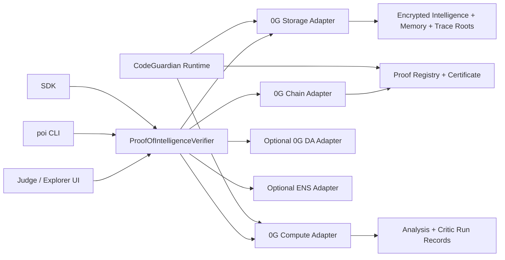

# Proof-of-Intelligence Explorer

Proof-of-Intelligence Explorer is a 0G-backed verification layer for iNFT-style agents. It answers one judge-facing question: **is this iNFT actually intelligent, or is it only NFT metadata?**

The product combines an explorer, SDK, CLI, registry, demo agent, and printable certificate flow so 0G iNFT teams can prove that encrypted intelligence, persistent memory, compute history, and executable behavior are embedded behind an agent token.

Hosted demo: https://proof-of-intelligence-explorer.vercel.app

## Why This Exists

Many "AI NFTs" prove ownership of a token and maybe point to metadata. They do not prove that an agent has:

- encrypted intelligence or behavior policy
- persistent memory that changes over time
- verifiable 0G Compute run history
- replayable execution traces
- a certificate/export bundle a judge can inspect

0G's iNFT track asks teams to link to a minted iNFT and prove embedded intelligence and memory. Proof-of-Intelligence Explorer is the reusable proof layer for that requirement.

## 0G Prize Alignment

The project is designed around 0G's full-stack AI infrastructure:

- **0G Chain:** demo iNFT, Proof-of-Intelligence registry, certificate issuance, and ownership checks on Galileo testnet.
- **0G Storage:** encrypted intelligence bundle, current memory checkpoint, immutable run trace, and evidence roots.
- **0G Compute:** CodeGuardian analysis and critic/self-review records with model/provider/run identifiers.
- **0G DA, optional:** exportable proof bundle for teams that want an additional data availability artifact.
- **ENS, optional:** light resolver support for nicer aliases; no ENS name is required.

Every public page labels evidence honestly as `live`, `hybrid`, or `mock`.

## Demo Agents

**CodeGuardian** is the seeded demo agent. It audits a deterministic TypeScript fixture, finds a bug/risk, proposes a patch, self-critiques the patch, writes memory, appends trace events, and emits certificate data.

**FakeAgent** is the control. It has token-like metadata but no valid Proof-of-Intelligence manifest, encrypted intelligence bundle, memory root, compute run history, or replayable trace. It should fail high-tier checks.

## Verification Tiers

| Tier | Result              | Meaning                                                         |
| ---- | ------------------- | --------------------------------------------------------------- |
| 0    | Unsupported         | Not recognized as an iNFT-style asset.                          |
| 1    | Token readable      | Token exists and ownership can be checked.                      |
| 2    | Manifest valid      | A `poi/v0.1` manifest is found and schema-valid.                |
| 3    | Intelligence proven | Encrypted intelligence bundle exists and root/hash matches.     |
| 4    | Memory proven       | Persistent memory checkpoint and current state roots verify.    |
| 5    | Behavior proven     | 0G Compute history and executable run trace verify.             |
| 6    | Certified           | Replayable certified agent with JSON/export/certificate bundle. |

## Quick Start

```bash
pnpm install
pnpm dev
```

Then open `http://localhost:3000`.

Useful local checks:

```bash
pnpm lint
pnpm typecheck
pnpm test
pnpm build
pnpm final:check
```

Mock demo commands:

```bash
pnpm seed:demo
pnpm demo:verify
pnpm demo:run-agent
pnpm demo:replay
pnpm demo:export-proof
```

CLI examples:

```bash
pnpm --filter @poi/cli poi verify codeguardian
pnpm --filter @poi/cli poi verify fakeagent
pnpm --filter @poi/cli poi run-codeguardian
pnpm --filter @poi/cli poi replay codeguardian-run-001
pnpm --filter @poi/cli poi export-proof codeguardian --out tmp/codeguardian-proof.json
pnpm --filter @poi/cli poi health
```

## Live 0G Setup

Copy `.env.example` to a local ignored env file and fill only local or Vercel-managed values. Never commit secrets.

Required live chain values:

- `0G_CHAIN_ID`
- `0G_RPC_URL`
- `0G_PRIVATE_KEY`
- `0G_WALLET_ADDRESS`
- `POI_ADMIN_TOKEN`
- `POI_ENABLE_LIVE_WRITES`

Optional live values:

- `0G_STORAGE_INDEXER_RPC`
- `0G_COMPUTE_PROVIDER`
- `0G_COMPUTE_MODEL`
- `0G_COMPUTE_SERVICE_URL`
- `0G_COMPUTE_BEARER_TOKEN`
- `0G_DA_ENDPOINT`

Live write scripts and admin routes must preflight chain ID, wallet address, balance, retry limits, and testnet-only guardrails before sending transactions.

## Vercel Deployment

Project name: `proof-of-intelligence-explorer`

```bash
vercel link
vercel env add NEXT_PUBLIC_APP_NAME production
vercel env add NEXT_PUBLIC_APP_URL production
vercel env add NEXT_PUBLIC_POI_PUBLIC_MODE production
vercel env add NEXT_PUBLIC_0G_CHAIN_ID production
vercel env add NEXT_PUBLIC_0G_RPC_URL production
vercel env add NEXT_PUBLIC_POI_REGISTRY_ADDRESS production
vercel env add NEXT_PUBLIC_POI_DEMO_INFT_ADDRESS production
vercel --prod
```

Set server-only secrets with Vercel sensitive environment variables or stdin/temp-file methods that do not print values. Do not expose private keys, bearer tokens, admin tokens, or encryption material to browser code.

See [DEPLOYMENT.md](DEPLOYMENT.md) for the full release flow.

## SDK Example

```ts
import { createVerifier, exportProofJson } from "@poi/sdk";

const verifier = createVerifier();
const report = await verifier.verify("codeguardian");

console.log(report.tier, report.status, report.evidence);
const proofJson = exportProofJson(report);
```

Manifest schema name:

```json
{
  "schema": "poi/v0.1",
  "name": "CodeGuardian",
  "inft": {
    "chainId": 16602,
    "contract": "<demo iNFT address>",
    "tokenId": "1",
    "standard": "ERC-7857-style"
  },
  "storage": {
    "manifestRoot": "<manifest root>",
    "intelligenceBundleRoot": "<encrypted intelligence root>",
    "memoryRoot": "<memory root>",
    "latestRunRoot": "<run root>"
  }
}
```

## Contracts

The contract slice is intentionally small:

- `DemoINFT.sol`: minimal ERC-721/ERC-7857-style demo iNFT that stores or references a manifest root.
- `ProofOfIntelligenceRegistry.sol`: passport registration, root updates, certificate issuance, and read APIs.
- certificate records: issued directly by the registry to keep the hackathon demo minimal and reliable.

Contract checks cover minting, passport registration, root updates, certificate issuance, unauthorized update rejection, and public reads.

## Architecture



## Public Explorer Pages

- `/` landing page
- `/verify`
- `/agent/codeguardian`
- `/agent/fakeagent`
- `/run/[runId]`
- `/certificate/[certificateId]`
- `/developer`
- `/mint-demo`
- `/admin`

Public pages must work without local setup. Admin write actions require a server-only admin token and must be disabled when live writes are not configured.

## Security Model

- The repository is public; secrets stay in ignored env files or Vercel sensitive env vars.
- Browser code sees only public display configuration.
- Admin routes require `POI_ADMIN_TOKEN` and never accept arbitrary calldata or raw transaction signing input.
- Live writes are allowlisted, testnet-only, idempotent where practical, and balance/chain preflighted.
- Public routes are read-only and must not return private env values.
- Demo encryption uses safe fixture content only; live owner decrypt remains server-gated until wallet-based decrypt is implemented.

See [docs/security.md](docs/security.md) for the checklist.

## Limitations

- Live 0G Storage, Compute, and DA adapters may run in hybrid/mock mode until official SDK wiring is available and configured.
- ENS support is intentionally light and optional.
- Printable HTML certificates are the reliable baseline; PDF export is optional if runtime dependencies permit.
- FakeAgent is a negative-control fixture, not a malicious-token detector.

## Submission Checklist

- Hosted URL recorded in `SUBMISSION.md`.
- Public GitHub URL recorded in `SUBMISSION.md`.
- Demo video URL added in the ETHGlobal dashboard.
- Contract addresses and minted iNFT link recorded after live deployment.
- CodeGuardian high-tier proof and FakeAgent failure shown in the explorer.
- JSON proof export and certificate page verified.
- No personal contact details or secrets committed.
