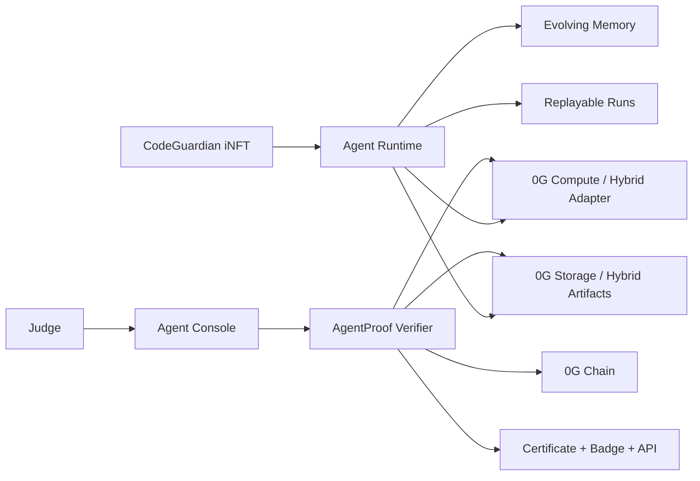

# CodeGuardian iNFT

**Powered by AgentProof - Proof-of-Intelligence Explorer for 0G Agentic ID / iNFT agents.**

CodeGuardian iNFT is an autonomous 0G Agentic ID / ERC-7857-style code-review agent. Its encrypted intelligence bundle is packaged as AES-256-GCM proof evidence, its memory evolves across certified runs, its critic loop is compute-backed or honestly hybrid-labeled, and every run is replayable through AgentProof.

Winning frame: **CodeGuardian is the autonomous iNFT agent. AgentProof is how judges verify it is real.**

- Live demo: https://proof-of-intelligence-explorer.vercel.app
- Public GitHub: https://github.com/fefe102/Proof-of-Intelligence-Explorer
- Judge Mode: https://proof-of-intelligence-explorer.vercel.app/judge
- Agent Console: https://proof-of-intelligence-explorer.vercel.app/agent/codeguardian/console
- Passport: https://proof-of-intelligence-explorer.vercel.app/passport/16602/0xa390c79f21a3b4f62f4797308f50f8ff9ea4f4c9/1

## Why It Matters

Many iNFTs can be metadata pointers. CodeGuardian proves a stronger claim: the Agentic ID has encrypted intelligence, persistent memory, replayable behavior, compute/critic evidence, dynamic policy upgrades, authorized execution semantics, and a certificate bound to a minted 0G iNFT.

AgentProof is the reusable verifier, SDK, CLI, registry, API, badge, and explorer that other 0G iNFT teams can adopt.

## Minted Agentic ID / iNFT

- Chain: 0G Galileo
- Chain ID: `16602`
- CodeGuardian iNFT contract: `0xa390c79f21a3b4f62f4797308f50f8ff9ea4f4c9`
- CodeGuardian token ID: `1`
- Owner: `0x053B860f329C9e4549D23dc8Aadf1116b99F1233`
- Proof registry: `0x90d7f68cbf2a860f7b2c54548095fcb72d61b9af`
- Passport ID: `0x01212ca92791787ccb99c454d3b59c5596f90882c892c7fca3e63294a159430c`
- Certificate record: `3`
- ChainScan: https://chainscan-galileo.0g.ai/address/0xa390c79f21a3b4f62f4797308f50f8ff9ea4f4c9

ChainScan links to the contract page; token ID `1` is the CodeGuardian iNFT. Token-specific proof is available in the AgentProof passport page.

## Proof Evidence

- Manifest root: `sha256:5704511de453c1a85d9ade4cf1b1c409f052a7556e184400070acc07900096b9`
- Encrypted intelligence root: `sha256:6289903e00f2e42448eb3cad30d322fcd4e1b3e3af54dd37f35a863a864f0bcd`
- Latest memory root: `sha256:cb8cffe9ff8d50f66a4b6fe30f0ba334fec4636b45f976f40360fe4afe405fce`
- Latest run root: `sha256:5eea73e8098964c75c6da1aba8d37e7f677b491e0c8a229818eef3f0a4069dad`
- Compute run IDs: `zg-hybrid-analysis-001`, `zg-hybrid-critic-001`, `zg-hybrid-analysis-002`, `zg-hybrid-critic-002`, `zg-hybrid-analysis-003`, `zg-hybrid-critic-003`
- Certificate ID: `poi-cert-codeguardian-001`

Current regenerated CodeGuardian artifacts are labeled `hybrid` unless re-uploaded through the live 0G Storage script. The chain deployment remains live on 0G Galileo. The UI and API show source labels per evidence layer and do not hide mock/hybrid evidence as live.

## Autonomous Flow

CodeGuardian runs a deterministic safe autonomous workflow:

1. Accept an allowlisted demo task.
2. Load a bundled TypeScript fixture.
3. Analyze the code through the 0G Compute adapter or deterministic hybrid fallback.
4. Identify one bug or risk.
5. Propose a bounded patch.
6. Run critic/self-review.
7. Decide whether the patch is safe.
8. Append trace events.
9. Write persistent memory.
10. Check dynamic skill/policy upgrades.
11. Commit trace roots.
12. Emit certificate data.

Trace events include `task_received`, `context_loaded`, `compute_started`, `compute_completed`, `issue_found`, `patch_proposed`, `critic_started`, `critic_completed`, `memory_delta_created`, `memory_written`, `skill_upgrade_checked`, `trace_committed`, and `certificate_issued`.

## Memory Evolution

CodeGuardian includes three sequential certified runs:

- `codeguardian-run-001`: unsafe JSON parsing. Learned pattern: validate JSON parse failures before using parsed payloads.
- `codeguardian-run-002`: missing authorization guard. Learned pattern: verify authorization before returning private records.
- `codeguardian-run-003`: unchecked async side effect. Learned pattern: wrap awaited side effects in explicit error handling.

After Run 002, CodeGuardian upgrades `critic-loop v0.1.0 -> v0.1.1` because it learned to require authorization checks before private records are read or returned. Skill/policy hashes are deterministic SHA-256 hashes of files under `examples/codeguardian/skills`.

## 0G Prize Alignment

- **0G Chain:** minted ERC-7857-style demo iNFT, registry, root updates, certificate records, and ownership checks.
- **0G Storage:** encrypted intelligence artifact, memory/current-state artifact, run traces, compute bundle, certificate bundle. Regenerated local artifacts are hybrid until live upload is rerun.
- **0G Compute:** analysis and critic run records use the same adapter shape as live 0G Compute; source labels show whether records are live or hybrid.
- **Optional 0G DA:** exportable proof bundle.
- **ENS:** not targeted for this submission; mock/compatibility hooks remain only for future live agent identity work.

## AgentProof Flows

- Verify CodeGuardian: `/agent/codeguardian`
- Open Agent Console: `/agent/codeguardian/console`
- Verify FakeAgent: `/agent/fakeagent`
- Verify any token: `/verify`
- Create Passport: `/create`
- Replay runs: `/run/codeguardian-run-001`, `/run/codeguardian-run-002`, `/run/codeguardian-run-003`
- Certificate: `/certificate/poi-cert-codeguardian-001`
- Badge: `/badge/16602/0xa390c79f21a3b4f62f4797308f50f8ff9ea4f4c9/1.svg`

## API And Badge

```text
GET /api/verify?agent=codeguardian
GET /api/verify?agent=fakeagent
GET /api/verify?chainId=16602&contract=0x...&tokenId=1
GET /api/passport/16602/0x.../1
GET /api/run/codeguardian-run-003
GET /api/certificate/poi-cert-codeguardian-001
GET /api/health
```

```md
[](https://proof-of-intelligence-explorer.vercel.app/passport/16602/0xa390c79f21a3b4f62f4797308f50f8ff9ea4f4c9/1)
```

## SDK And CLI

```ts
import { createVerifier, createPoiRecorder } from "@poi/sdk";

const verifier = createVerifier();
const report = await verifier.verify("codeguardian");

const recorder = createPoiRecorder({
  chainId: 16602,
  contract: "0x...",
  tokenId: "1"
});
```

```bash
pnpm --filter @poi/cli poi verify codeguardian
pnpm --filter @poi/cli poi verify fakeagent
pnpm --filter @poi/cli poi verify --chain-id 16602 --contract 0xa390c79f21a3b4f62f4797308f50f8ff9ea4f4c9 --token-id 1
pnpm --filter @poi/cli poi run-codeguardian
pnpm --filter @poi/cli poi replay codeguardian-run-003
pnpm --filter @poi/cli poi export-proof codeguardian --out tmp/codeguardian-proof.json
```

## Local Setup

```bash
pnpm install
pnpm dev
```

Useful checks:

```bash
pnpm lint
pnpm typecheck
pnpm test
pnpm contracts:test
pnpm build
pnpm final:check
```

Generate deterministic public proof artifacts:

```bash
pnpm demo:generate-artifacts
pnpm seed:demo
```

## Live 0G Setup

Copy `.env.example` to an ignored local env file. Never commit secrets.

Required for guarded live writes:

- `0G_CHAIN_ID=16602`
- `0G_RPC_URL`
- `0G_PRIVATE_KEY`
- `0G_WALLET_ADDRESS`
- `POI_ADMIN_TOKEN`
- `POI_ENABLE_LIVE_WRITES=true`

Optional:

- `0G_STORAGE_INDEXER_RPC`
- `0G_COMPUTE_PROVIDER`
- `0G_COMPUTE_MODEL`
- `0G_COMPUTE_SERVICE_URL`
- `0G_COMPUTE_BEARER_TOKEN`

Live scripts preflight chain ID, wallet address, balance, retry limits, and allowlisted actions before spending 0G Galileo testnet funds.

## Contracts

- `DemoINFT.sol`: ERC-7857-style demo iNFT with manifest, intelligence, memory, latest-run, usage, skill-hash, and certification semantics.
- `ProofOfIntelligenceRegistry.sol`: passport registration, root updates, certificate issuance, and public reads.

This is ERC-7857-style proof semantics aligned to 0G iNFT requirements, not a generic marketplace.

## Architecture



## Security

- Public pages and APIs are read-only.
- Admin writes require `POI_ADMIN_TOKEN` and are disabled unless `POI_ENABLE_LIVE_WRITES=true`.
- Browser code never receives private keys, bearer tokens, admin tokens, encryption keys, mnemonics, or keystores.
- No arbitrary calldata, raw transaction signing, shell execution, or untrusted repo execution is accepted from public input.
- Demo encryption uses safe fixture content only. Real secrets stay in ignored env files or Vercel sensitive env vars.

## Limitations / Future Work

- Regenerated proof artifacts are hybrid until live 0G Storage upload is rerun.
- Wallet-owned create-passport writes are future work; hosted create flow is currently a deterministic preview.
- Optional DA is export-only.
- ENS is intentionally not a prize target in this version. The repo keeps mock/compatibility hooks, but no live ENS identity is claimed.
- Demo video URL is added in the ETHGlobal dashboard.

Team/contact details are provided in the ETHGlobal dashboard and omitted from this public repository.
