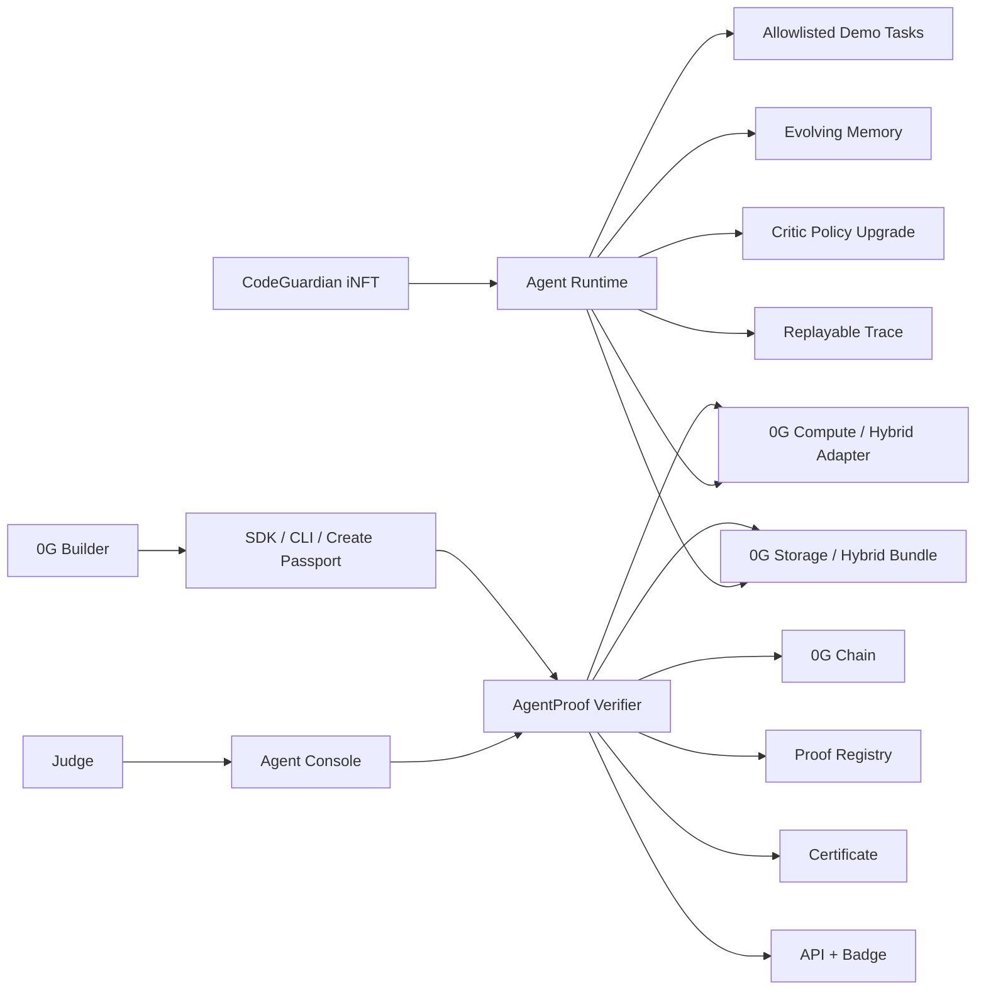

# Architecture

## Packages

- `apps/explorer`: hosted Agent Console, verifier, passport, certificate, replay, APIs, badge, admin.
- `packages/agent-runtime`: deterministic CodeGuardian autonomous runs, memory evolution, replay.
- `packages/sdk`: schemas, canonical hashing, verifier, adapters, encryption helpers, recorder.
- `packages/cli`: demo, verify, run, replay, export, live script wrappers.
- `contracts`: ERC-7857-style demo iNFT and Proof-of-Intelligence registry.
- `examples/codeguardian`: fixtures and skill/policy files used for deterministic hashes.

## Trust Boundaries

- Public pages and APIs are read-only.
- Browser input never becomes calldata, shell commands, or untrusted code execution.
- Admin writes require server-only token and remain disabled unless configured.
- Source labels are attached per evidence layer.
